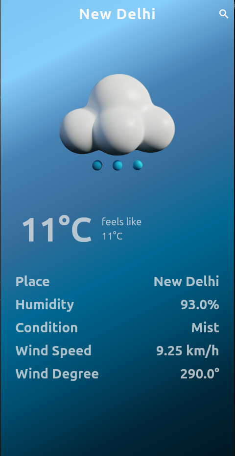

# Weather App

A weather forecasting app that provides current weather information based on city names. It includes real-time weather data such as temperature, humidity, wind speed, and weather conditions. Users can search for any city to view the weather details.

## Features

- **City Search:** Search for weather data by city name.
- **Real-Time Weather Data:** Displays the current temperature, humidity, wind speed, and weather condition.
- **Dynamic Weather Icons:** Cloud images and icons change according to the weather conditions.
- **UI:** Beautiful gradient backgrounds and smooth UI design.

## Screenshots

  


## Installation

### Prerequisites

- Flutter 2.0+
- Android Studio or Visual Studio Code
- An active internet connection for fetching weather data

### Steps to Install

1. Clone this repository:
   ```bash
   git clone https://github.com/Ankitkumardmk98/Weather_App.git
   ```

2. Install dependencies:
    ```bash
    flutter pub get
    ```

3. Run the app:
    ```bash
    flutter run
    ```

4. Set up your OpenWeather API key:

    Go to OpenWeather and create an account.
    Get your API key.
    Replace the weatherAppAPIKey variable in the app with your API key.

5. Usage:

    -Enter a city name in the search bar at the top of the screen.
    -View the current temperature, humidity, wind speed, and weather condition.
    -The cloud image will change dynamically based on the weather description.
6. Dependencies:
    ```bash
    weather: A package to fetch weather data.
    flutter: Flutter framework for building the app.
    ```
7. Known Issues:

    The app may not display data if the API key is invalid or expired.
    The app may take time to load the weather data depending on your internet connection.